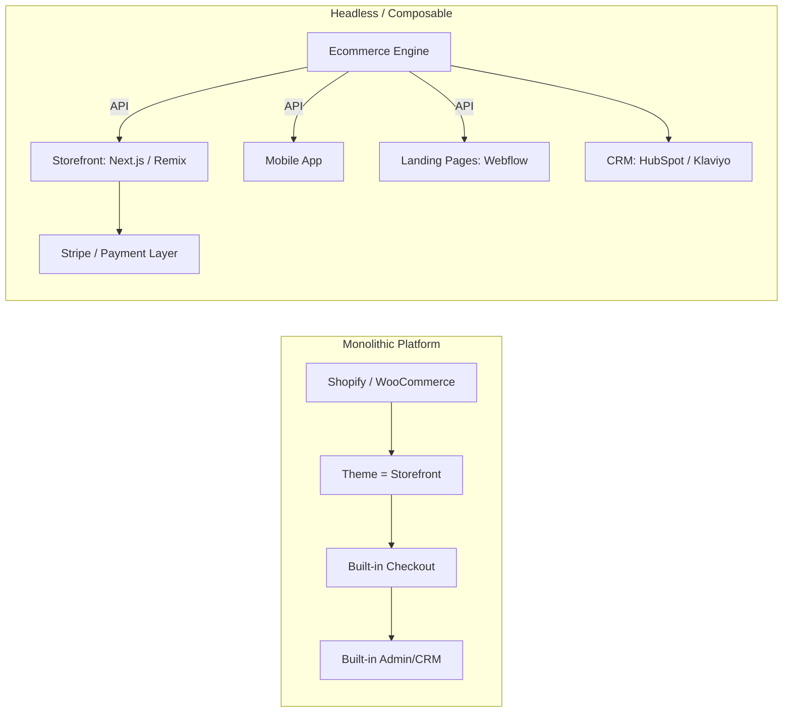
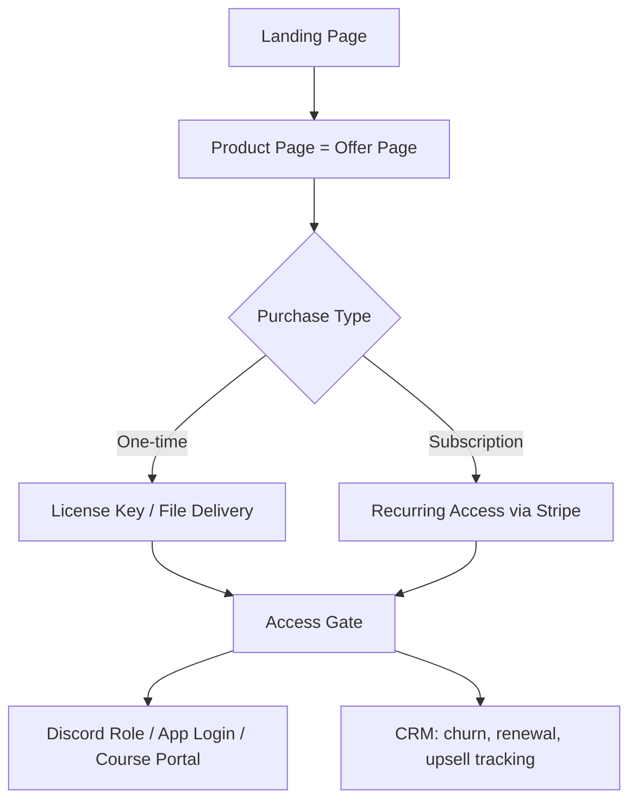
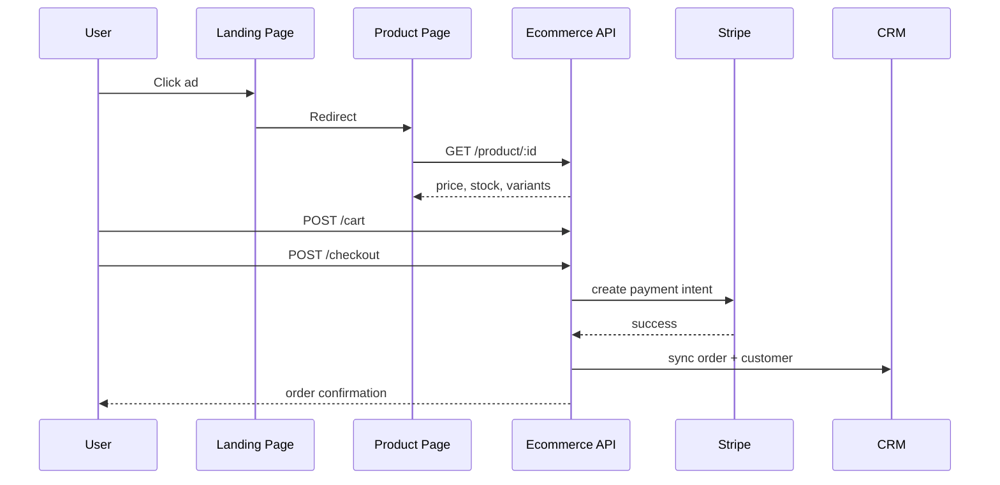
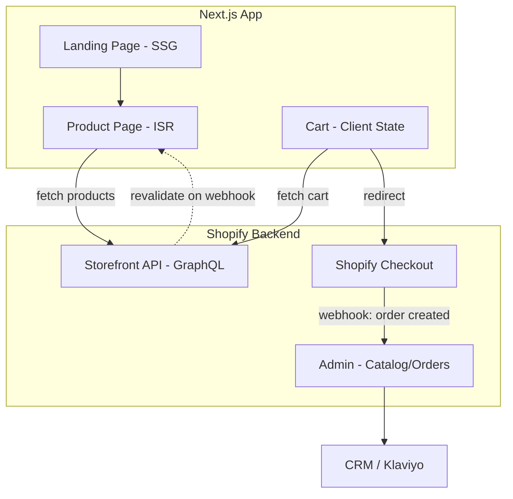
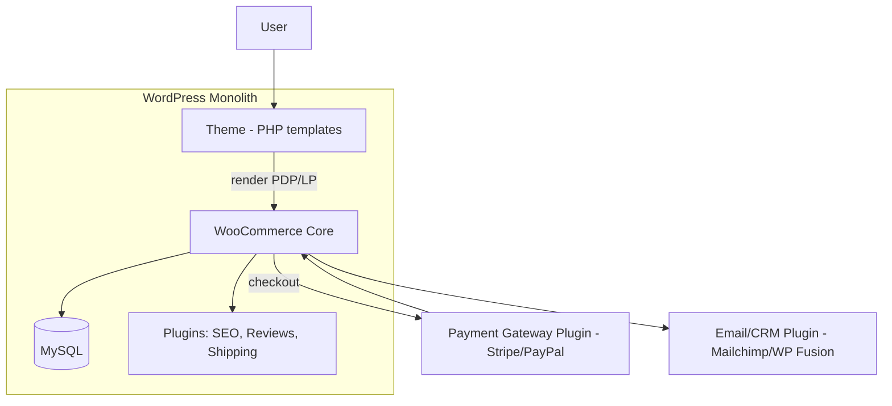
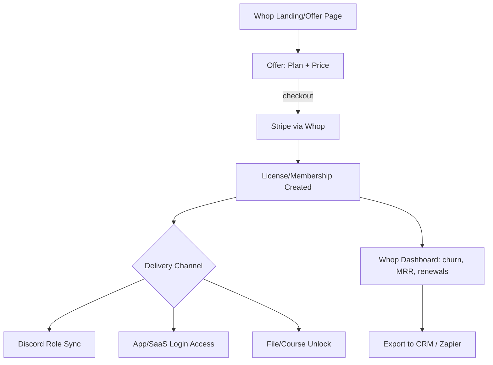
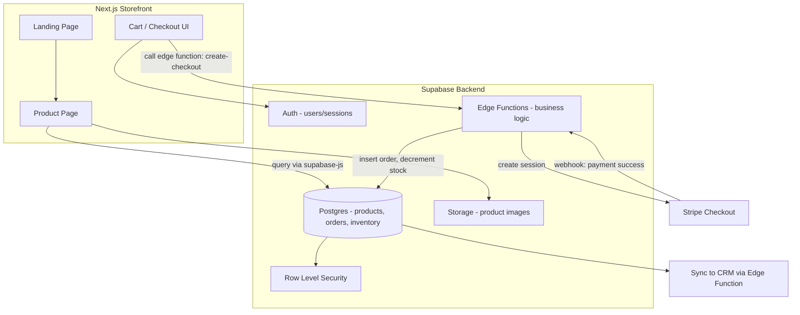

# E-Commerce Stack — Engineer's Cheat Sheet

## 1. Glossary (one line each)

| Term | Definition |
|---|---|
| **Ecommerce Platform** | All-in-one SaaS: hosting + storefront + checkout + admin (Shopify, BigCommerce). |
| **Ecom Builder** | Drag-and-drop UI to assemble a store without code (Shopify themes, Wix, Webflow Ecom). |
| **Headless** | Frontend decoupled from backend; you build UI, backend exposes API only. |
| **WooCommerce** | Open-source ecom plugin on top of WordPress. Self-hosted, PHP/MySQL. |
| **Whop** | Digital-product / membership commerce platform, creator-economy focused (licenses, Discord roles, SaaS access). |
| **Stripe** | Payment infrastructure (API-first): charges, subscriptions, payouts, tax, fraud. |
| **Ecommerce Engine** | The backend core: catalog, cart, pricing, inventory, order logic. |
| **Ecommerce API** | Interface exposing engine functions (products, cart, checkout) to any frontend. |
| **Storefront** | Customer-facing site/app that consumes the engine/API. |
| **Landing Page** | Single-purpose acquisition page (ad → conversion), not full catalog. |
| **Product Page (PDP)** | Page for one SKU: images, price, variants, add-to-cart. |
| **CRM** | Customer data + lifecycle system: emails, segments, LTV, support history. |

---

## 2. Architecture A — Monolithic vs Headless

**Rule of thumb:** Monolithic = fast to launch, hard to customize. Headless = slow to launch, unlimited customization.

---

## 3. Stack Combos (pick one)

| Combo | Engine | Storefront | Payments | CRM | Best for |
|---|---|---|---|---|---|
| **1. Turnkey** | Shopify | Shopify theme | Shopify Payments / Stripe | Shopify + Klaviyo | Small biz, fast launch |
| **2. Open-source** | WooCommerce | WordPress theme | Stripe/PayPal plugin | Mailchimp/WP CRM | Budget, content+shop hybrid |
| **3. Headless Composable** | Shopify/Commerce Layer/Medusa (API) | Next.js custom frontend | Stripe | Segment → HubSpot | Scale, custom UX, multi-channel |
| **4. Creator/Community** | Whop | Whop-hosted storefront | Stripe/Whop payments | Whop native + Discord | Digital goods, memberships, SaaS licenses |

---

## 4. Alternative Business Design System — Creator/Access Commerce (Whop-style)

Not a "product catalog" model — an **access/license** model. Different mental model from classic ecom:

Key diff vs classic storefront:
- No shipping/inventory concept.
- "Product" = access rights, not physical SKU.
- CRM tracks **access lifecycle** (active/expired/refunded), not shipping status.

---

## 5. Request Flow — Storefront to Engine

---

## 6.1 Design System — Next.js + Shopify (Headless)

- Frontend = pure presentation, no business logic.
- Shopify keeps: inventory, tax, checkout, payments.
- Trade-off: you don't own checkout UX (unless Shopify Plus + Checkout Extensibility).

---

## 6.2 Design System — WordPress + WooCommerce

- Everything server-rendered, single codebase, single DB.
- Fast to extend via plugins, slow at scale (plugin bloat = perf risk).
- No native API-first mindset unless you enable WooCommerce REST/GraphQL.

---

## 6.3 Design System — Whop (Access Commerce)

- No inventory. "Product" = a plan definition, not a SKU.
- Delivery = access grant, not shipment.
- Ideal for SaaS resellers, communities, digital licenses.

---

## 6.4 Design System — Supabase + Stripe + Next.js (DIY Headless Engine)

- You build the "engine" yourself: catalog, cart, inventory logic = your Postgres schema + Edge Functions.
- Full control, zero platform fees, but you own bugs, security (RLS), and scaling.
- Best when: custom business logic Shopify/Whop can't express (marketplaces, custom pricing rules, complex access tiers).

---

## 7. Decision Table — Which Stack?

| Need | Use |
|---|---|
| Ship in 1 week, non-technical team | Ecom Builder (Shopify/Wix) |
| WordPress content site + shop | WooCommerce |
| Full custom UX, multi-frontend (web+app) | Headless + Ecommerce API |
| Digital products, memberships, no shipping | Whop |
| Just need to charge money, build everything else | Stripe only |
