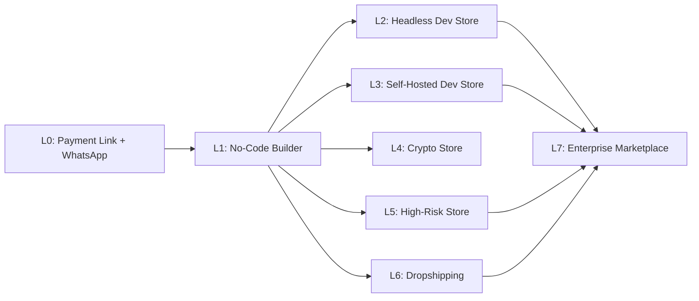
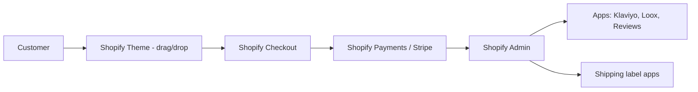
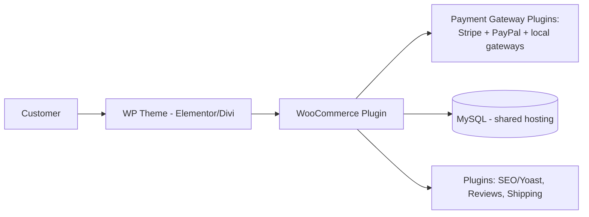
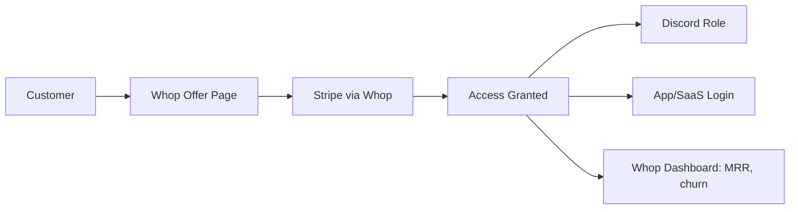
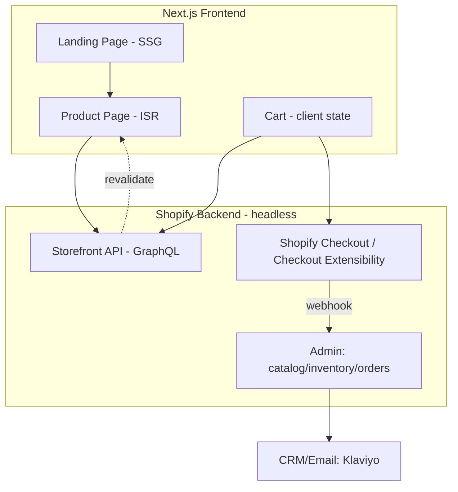
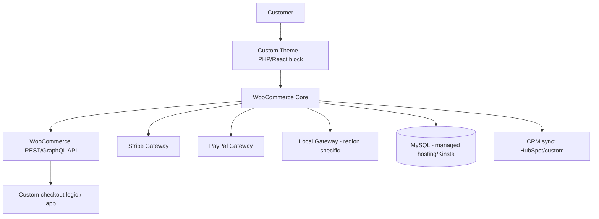
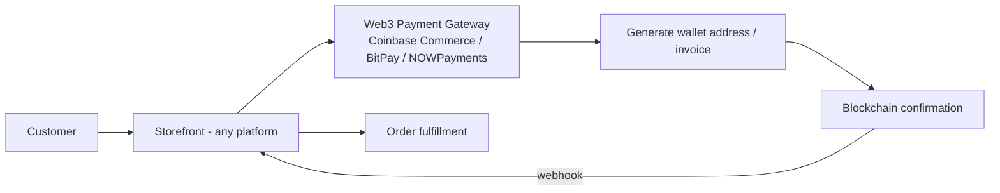
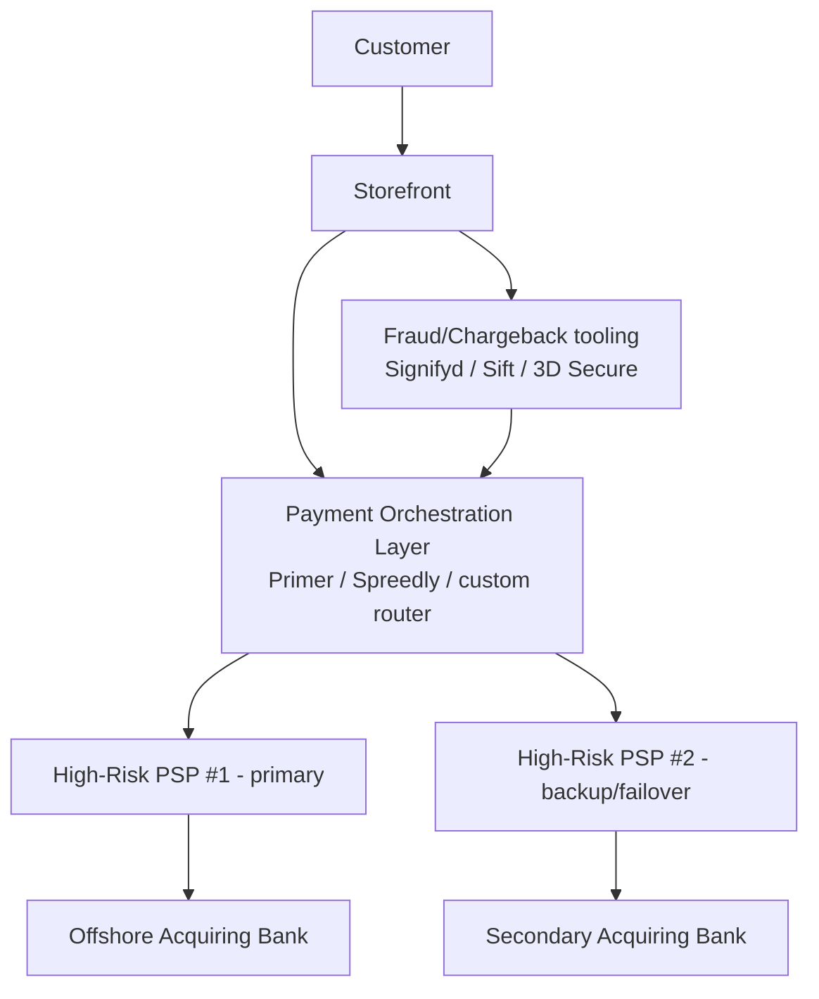
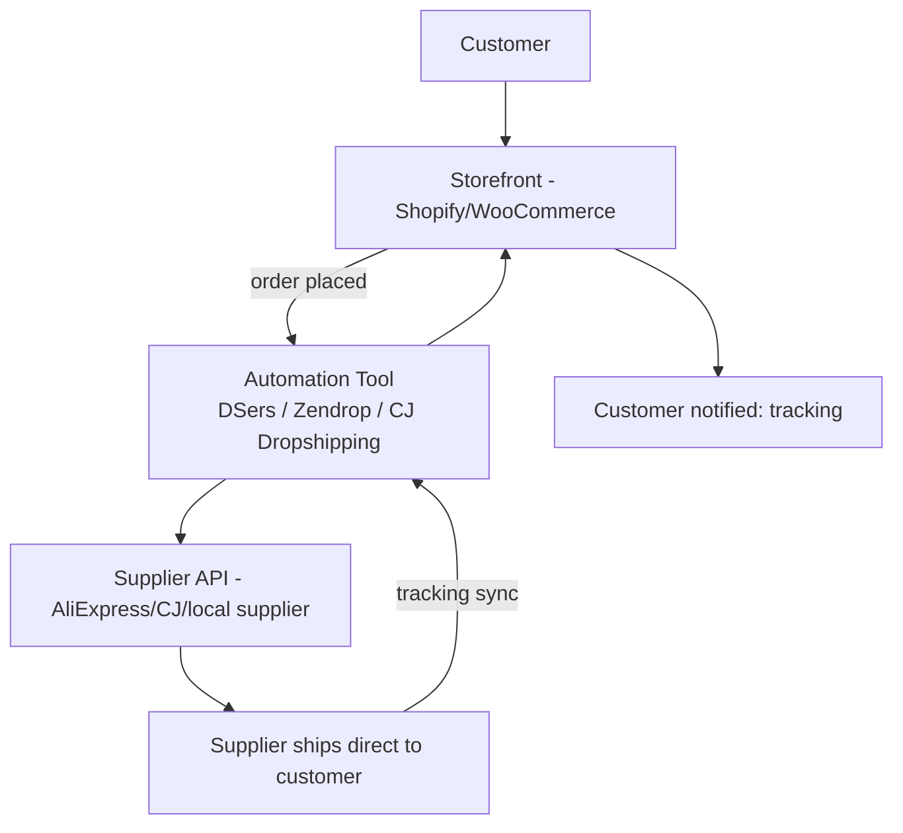
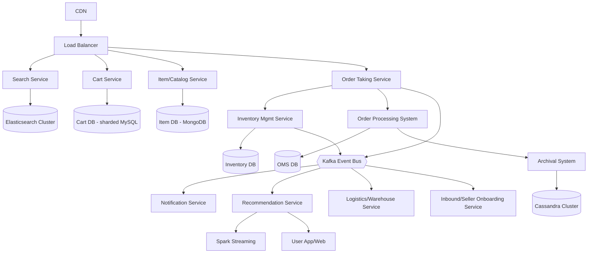

# Ecom Architecture — Pick The Right Stack For The Right Mission

Scaling ladder: each level = more control, more dev work, more cost. Pick the lowest level that satisfies your mission — don't over-engineer.



---

## Level 0 — Zero-Code: Payment Link + WhatsApp Static Page

**Mission:** sell today, zero budget, zero dev, 1-20 SKUs.

```mermaid
flowchart LR
    C[Customer] --> IG[Instagram/WhatsApp Catalog]
    IG --> DM[DM: "I want this"]
    DM --> PL[Seller sends Payment Link<br/>Stripe Payment Link / PayPal.me]
    PL --> PAY[Customer pays]
    PAY --> MAN[Manual fulfillment]
    MAN --> SHEET[Google Sheet = CRM/Inventory]
```

- No storefront, no code, no hosting.
- "Catalog" = WhatsApp Business catalog or Instagram Shop tab (static, no cart logic).
- Payment = link, not integrated checkout (Stripe Payment Links, PayPal.me, Wave).
- CRM = spreadsheet. Fulfillment = manual (you pack, you ship).
- **Limit:** doesn't scale past ~20-30 orders/day manually.

---

## Level 1 — No-Code Builder (pick your platform)

**Mission:** real storefront, no dev team, launch in days.

### 1a. Shopify (No-Tech Approach)

- You configure, you don't code. Theme editor + App Store plugs gaps.

### 1b. WordPress + WooCommerce (No-Tech Approach)

- Cheapest to run, most plugin risk (conflicts, security patches).

### 1c. Whop (Digital/Access Products, No-Tech Approach)

- No inventory, no shipping. Sell licenses/subscriptions/community access.

| Platform | Setup time | Monthly cost | Best mission |
|---|---|---|---|
| Shopify | Hours | $$ (plan+apps) | Physical goods, fast launch |
| WooCommerce | Half day | $ (hosting only) | Content site + shop combo, budget-first |
| Whop | Hours | % of revenue | Digital goods, communities, SaaS resale |

---

## Level 2 — Headless Dev Store: Next.js + Shopify API

**Mission:** custom UX/branding, multi-channel (web+app), dev team available.


- Shopify still owns: inventory, tax, PCI-compliant checkout.
- You own: every pixel of the frontend, performance, SEO, multi-storefront (web/app/kiosk).
- Also swappable engine: Medusa, Commerce Layer, Saleor instead of Shopify API.

---

## Level 3 — Self-Hosted Dev Store: WordPress + WooCommerce + Stripe + PayPal (Custom)

**Mission:** full backend control, custom checkout flow, multiple payment gateways, dev team available.


- Multiple gateways = redundancy + regional coverage (some countries: PayPal only, others: card only).
- Custom plugin/API layer lets you inject business logic WooCommerce can't (custom pricing, B2B tiers).

---

## Level 4 — Crypto Store

**Mission:** crypto-native audience, no chargebacks, borderless.


- No chargebacks (final settlement) — good for high-risk-adjacent products.
- Volatility risk: auto-convert to fiat via gateway to avoid holding crypto.
- Can bolt onto Shopify/WooCommerce as an extra payment method, or be the only method.

---

## Level 5 — High-Risk Store

**Mission:** product category flagged high-risk (CBD, supplements, adult, gambling, subscriptions/continuity, nutra, travel, firearms accessories).


- Never rely on ONE processor — accounts get frozen/terminated often. Orchestration = survival.
- Higher fees (5-10%+), rolling reserves held by acquirer.
- 3D Secure + fraud scoring mandatory to keep chargeback ratio under network thresholds (~1%).

---

## Level 6 — Dropshipping Store

**Mission:** validate product-market fit with zero inventory investment.


- Store never touches inventory. Margin = retail price − supplier price − ads.
- Weak point: shipping time (7-20 days unless using local/US warehouses) and QC.
- Often flagged high-risk by payment processors too (chargeback-prone) → combine with Level 5 practices.

---

## Level 7 — Enterprise Marketplace (Amazon / Etsy / eBay scale)

**Mission:** multi-vendor marketplace, millions of SKUs, massive concurrent traffic.



Key differences vs single-merchant store:
| Concern | Single Store | Marketplace |
|---|---|---|
| Catalog | 1 seller | Multi-tenant, seller-owned SKUs |
| Payments | 1 payout | Split payments/commission engine (marketplace escrow) |
| Search | Basic filter | Elasticsearch/Solr, relevance ranking |
| Data scale | Single DB | Sharded DBs + Kafka + Cassandra/Spark |
| Logistics | Manual/3PL | Warehouse/Inbound/Logistics microservices |
| Trust | Merchant reputation | Buyer/seller rating, dispute resolution |

- **Amazon** = marketplace + FBA logistics + private label, owns warehousing.
- **Etsy** = marketplace for handmade/vintage, lighter logistics, seller ships themselves.
- **eBay** = marketplace + auction model, managed payments layer, C2C + B2C mix.

---

## Decision Matrix — Match Mission to Architecture

| Situation / Mission | Architecture |
|---|---|
| Sell 1-20 items, zero budget, today | L0 — Payment Link + WhatsApp |
| First real store, no dev team | L1a Shopify or L1b WooCommerce |
| Digital product / community / SaaS resale | L1c Whop |
| Already have WordPress content site | L1b WooCommerce |
| Need custom UX, multi-channel, have devs | L2 — Next.js + Shopify API |
| Need full backend control + multiple gateways | L3 — WordPress/WooCommerce custom |
| Crypto-native audience / avoid chargebacks | L4 — Crypto store |
| Product category = CBD/adult/gambling/nutra/subscriptions | L5 — High-risk orchestration |
| Testing product-market fit, no capital for inventory | L6 — Dropshipping |
| Multi-vendor, millions of SKUs, global scale | L7 — Marketplace microservices |
