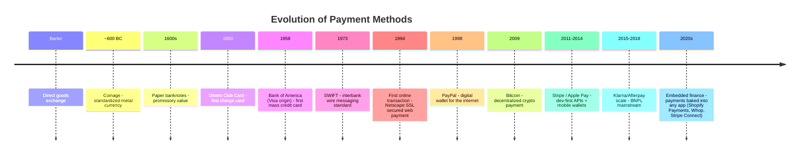
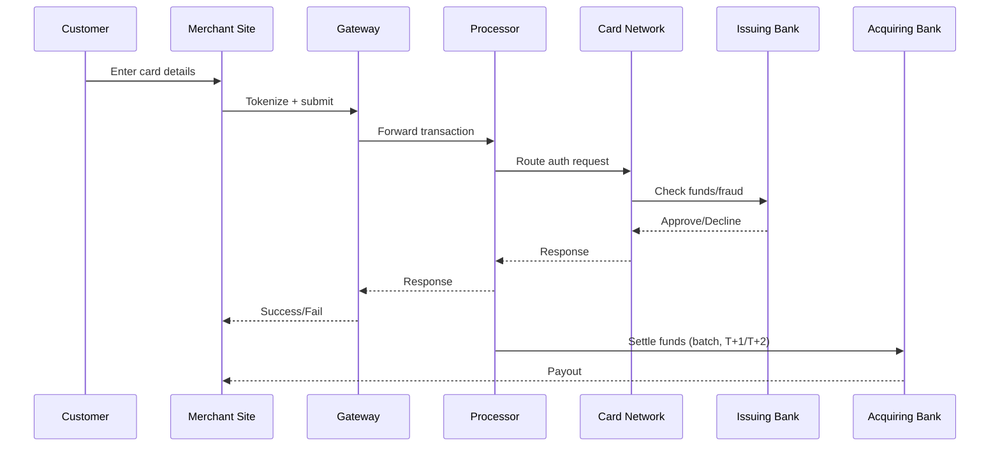

# Payments — Engineer's Cheat Sheet

## 1. Glossary

| Term | Definition |
|---|---|
| **Payment Gateway** | Captures card/payment data at checkout, encrypts it, sends to processor. (Stripe Checkout, Braintree). |
| **Payment Processor** | Moves the transaction data between gateway, card network, and banks. |
| **PSP (Payment Service Provider)** | Bundles gateway + processor + merchant account into one (Stripe, PayPal, Adyen). |
| **Acquirer / Acquiring Bank** | Merchant's bank — receives the funds. |
| **Issuer / Issuing Bank** | Customer's bank — released the card, holds their funds. |
| **Card Network** | Rails moving the authorization (Visa, Mastercard, Amex). |
| **ACH** | Direct bank-to-bank transfer (US), slow (1-3 days), low fee. |
| **Wire Transfer** | Bank-to-bank, real-time-ish, high fee, used for large sums. |
| **Digital Wallet** | Stored payment credential + auth layer (Apple Pay, Google Pay, PayPal Wallet). |
| **BNPL** | Buy Now Pay Later — installment credit at checkout (Klarna, Afterpay). |
| **Stablecoin / Crypto Payment** | Blockchain-settled payment, bypasses card rails. |
| **Payment Orchestration** | Layer routing transactions across multiple PSPs for cost/uptime (Primer, Spreedly). |
| **Tokenization** | Replacing card number with a non-sensitive token for storage/reuse. |
| **PCI-DSS** | Security standard for anyone touching card data. |
| **Chargeback** | Forced refund initiated by cardholder's bank, not merchant. |

to add payment link, examples typees
---

## 2. Brief History (Timeline)

**Gist:** trust moved from *object* (coin) → *institution* (bank/card network) → *platform* (PayPal/Stripe) → *protocol* (crypto) → *invisible layer* (embedded/API-first).

---

## 3. Card Payment Flow

---

## 4. Method Comparison

| Method | Speed | Fee | Reversibility | Best for |
|---|---|---|---|---|
| Card | Instant auth, T+1/2 settle | ~2.9% + $0.30 | Chargeback risk | General ecom |
| ACH | 1-3 days | Flat, low (~$0.25-1) | Can bounce/reverse | B2B, subscriptions |
| Wire | Same day | High ($15-50) | Near-final | Large one-off payments |
| Digital Wallet | Instant | Same as underlying card | Same as card | Mobile checkout, one-tap |
| BNPL | Instant for merchant | Merchant pays 4-6% | Provider absorbs risk | High-ticket, younger demo |
| Crypto/Stablecoin | Minutes | Network gas fee | Final (no chargebacks) | Cross-border, no intermediary |

---

## 5. Outline Gist (one-screen recap)

1. **Definition** → payments = moving trust + value from payer to payee through intermediaries.
2. **History** → object-based → institution-based → platform-based → protocol-based.
3. **Flow** → Customer → Gateway → Processor → Network → Issuer/Acquirer → Merchant payout.
4. **Modern shift** → payments becoming invisible, embedded directly into products (Stripe Connect, Shopify Payments, Whop).
5. **Engineer's concern** → PCI compliance, tokenization, webhook reliability (idempotency), chargeback handling.
