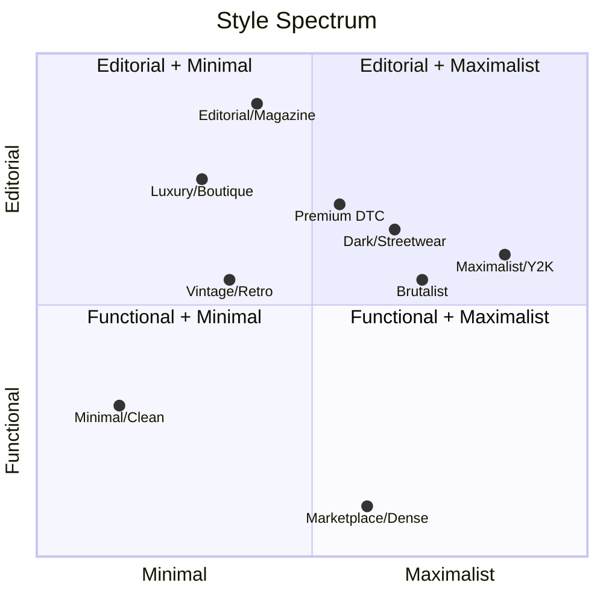

# Templates — Styles, Where to Buy, Where to Get Inspired

## 1. Style Glossary

| Style | Look & Feel | Example Brand Vibe |
|---|---|---|
| **Premium DTC** | Bold hero imagery, big product photography, social proof strip, bold CTA | Allbirds, Gymshark, Glossier |
| **Editorial / Magazine** | Large typography, storytelling blocks, blog-like scroll, less "shop", more "read" | Kinfolk-style brands, Aesop |
| **Minimal / Clean** | White space, thin type, few colors, product = hero | Muji, Everlane |
| **Luxury / Boutique** | Dark background, serif fonts, slow animations, low CTA density | Net-a-Porter, niche fashion |
| **Maximalist / Y2K / Gen Z** | Bright colors, chaotic grid, stickers, motion, meme-adjacent | Drop culture, streetwear resale |
| **Brutalist** | Raw grid, monospace font, visible borders, anti-polish | Indie/design-forward brands |
| **Dark Mode / Streetwear** | Black background, neon accents, drop/hype energy | Sneaker/streetwear stores |
| **Marketplace / Dense Grid** | Filters everywhere, dense product grid, function over form | Amazon, Etsy, eBay |
| **Vintage / Retro** | Warm tones, textured backgrounds, nostalgic type | Craft/heritage brands |

---

## 2. Where to Buy — Premium Templates

| Source | Platform | Price Range | Known For |
|---|---|---|---|
| **Shopify Theme Store** | Shopify | $150-500 (one-time) | Official, vetted, App Bridge compatible |
| **Envato ThemeForest** | WooCommerce/HTML/Shopify | $20-100 | Huge volume, mixed quality, cheap |
| **Shrine Themes** | Shopify | $200-400 | Premium DTC, high-fashion look |
| **Out of the Sandbox** | Shopify | $200-350 | Parallax/Turbo/Flex — DTC classics |
| **Pixel Union** | Shopify | $200-300 | Editorial/lookbook heavy |
| **FoxThemes (Halo, Motion)** | Shopify | $200-350 | Fast, conversion-optimized |
| **Turbo by Swanky** | Shopify | $250+ | Speed-focused, enterprise DTC |
| **Flatsome / Astra Pro** | WooCommerce | $60-100/yr | Best-selling WooCommerce builder themes |
| **Creative Market** | HTML/Webflow/Figma | $20-80 | Design-forward, indie creators |
| **Webflow Marketplace** | Webflow | $30-150 | No-code, highly customizable |

---

## 3. Where to Get — Free Templates

| Source | Platform | Notes |
|---|---|---|
| **Shopify free themes** (Dawn, Sense, Craft, Refresh) | Shopify | Official, fast, minimal — good base to customize |
| **WooCommerce Storefront** | WordPress | Official free theme, plugin-compatible |
| **HTML5 UP** | Static HTML | Free landing pages, good for L0/L1 mini-sites |
| **Webflow free templates** | Webflow | Limited but solid starting points |
| **Next.js Commerce (Vercel)** | Headless (GitHub) | Free open-source storefront starter, Shopify/BigCommerce ready |
| **Medusa Storefront starter** | Headless (GitHub) | Free open-source, pairs with Medusa engine |
| **Figma Community** | Design file (UI kit) | Free ecom UI kits to prototype before building |

---

## 4. Where to Get Inspired (not to buy — just look)

| Source | What it's for |
|---|---|
| **Awwwards** | High-end web design showcase, filter by "e-commerce" |
| **Land-book** | Landing page gallery, filterable by industry |
| **One Page Love** | One-page/landing page inspiration |
| **Mobbin** | Real mobile app UI patterns (great for checkout/PDP flows) |
| **Siteinspire** | Curated web design gallery |
| **Godly** | Modern/experimental site design |
| **Built for Mars** | UX teardown of real checkout/onboarding flows (paid deep dives) |
| **Baymard Institute** | UX research benchmarks for ecom (checkout, PDP, cart) — paid |
| **Shopify Examples** | Real stores built on Shopify, browsable by industry |

---

## 5. Quick Pick

| Mission | Style | Get it from |
|---|---|---|
| Fast DTC launch, bold brand | Premium DTC | Shrine, Out of the Sandbox |
| Storytelling brand, content-heavy | Editorial | Pixel Union, Webflow Marketplace |
| Budget WooCommerce store | Minimal | Astra Pro / Flatsome |
| Streetwear/hype drop | Dark/Streetwear | ThemeForest, custom Webflow |
| High-fashion/luxury | Luxury/Boutique | Shrine, custom build |
| Marketplace/dense catalog | Marketplace grid | Custom (no template fits — build) |
| No budget, need something today | Minimal | Shopify Dawn / WooCommerce Storefront (free) |
