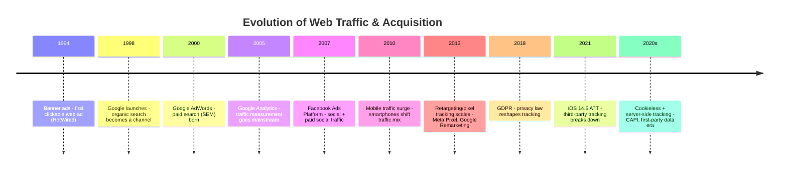
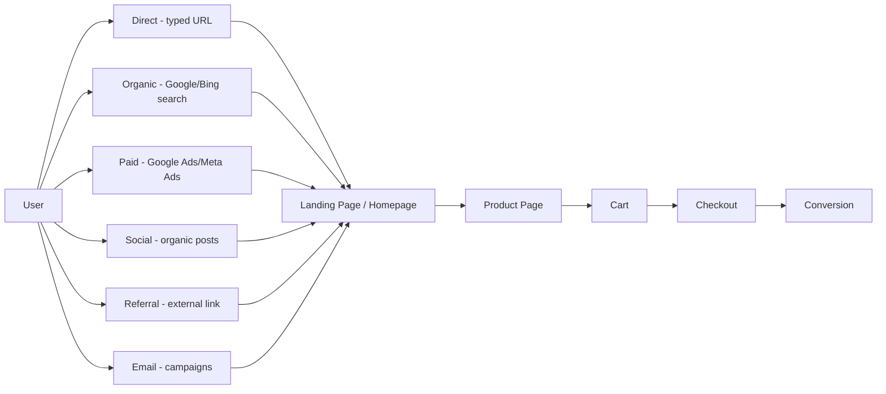
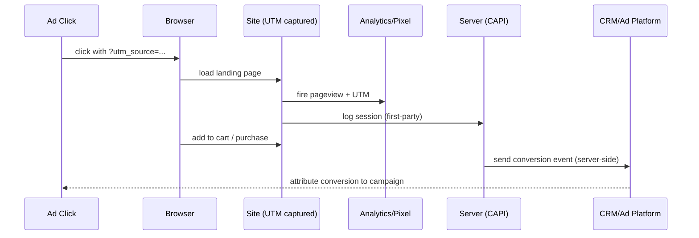

# Traffic — Engineer's Cheat Sheet

## 1. Glossary

| Term | Definition |
|---|---|
| **Organic Traffic** | Unpaid visits from search engines (SEO-driven). |
| **Paid Traffic** | Visits bought via ads (PPC, social ads). |
| **Direct Traffic** | User typed URL or used bookmark — no referring source. |
| **Referral Traffic** | Arrived via link on another site (blog, partner). |
| **Social Traffic** | Arrived from social platforms (organic or paid). |
| **SEO** | Search Engine Optimization — ranking higher organically. |
| **SEM** | Search Engine Marketing — paid search ads (Google Ads). |
| **PPC** | Pay-Per-Click — you pay per ad click. |
| **CPC** | Cost Per Click — price paid for one click. |
| **CPM** | Cost Per Mille — price per 1,000 ad impressions. |
| **CTR** | Click-Through Rate — clicks ÷ impressions. |
| **CVR** | Conversion Rate — conversions ÷ visits. |
| **Bounce Rate** | % of visitors who leave after one page. |
| **UTM Parameters** | URL tags tracking source/medium/campaign. |
| **Attribution** | Model crediting which touchpoint caused a conversion (first-click, last-click, multi-touch). |
| **Retargeting** | Ads shown to users who already visited but didn't convert. |
| **Funnel** | Stages a visitor passes: awareness → consideration → conversion. |
| **CAC** | Customer Acquisition Cost — total spend ÷ new customers. |
| **LTV** | Lifetime Value — total revenue expected per customer. |
| **Landing Page Traffic** | Visits hitting a dedicated conversion-focused page (vs homepage). |
| **Referrer Header** | HTTP header telling server which page linked to this request. |

---

## 2. Brief History (Timeline)

**Gist:** traffic measurement moved from *none* → *pixel-based tracking everywhere* → *privacy pushback* → *first-party/server-side tracking*.

---

## 3. Traffic Sources Map

---

## 4. Funnel + Attribution Flow

---

## 5. Channel Comparison

| Channel | Cost Model | Speed to Results | Control | Best for |
|---|---|---|---|---|
| Organic/SEO | Free (time cost) | Slow (months) | Low (algorithm-dependent) | Long-term compounding traffic |
| Paid Search | CPC | Fast | High | High-intent buyers |
| Paid Social | CPM/CPC | Fast | High | Discovery, retargeting |
| Referral | Free/rev-share | Medium | Medium | Trust-driven conversion |
| Email | Low fixed cost | Fast | High | Retention, repeat purchase |
| Direct | Free | N/A | Low | Brand strength indicator |

---

## 6. Outline Gist (one-screen recap)

1. **Definition** → traffic = visitors arriving through a specific channel/source.
2. **History** → no tracking → pixel tracking everywhere → privacy laws → first-party/server-side tracking.
3. **Flow** → Source → Landing Page → Product Page → Cart → Checkout → Conversion, tagged via UTM, measured via Analytics + Server-side (CAPI).
4. **Modern shift** → cookieless world pushes tracking server-side and first-party.
5. **Engineer's concern** → UTM consistency, pixel + CAPI dedup, page speed (affects bounce/CVR), attribution data pipeline.
